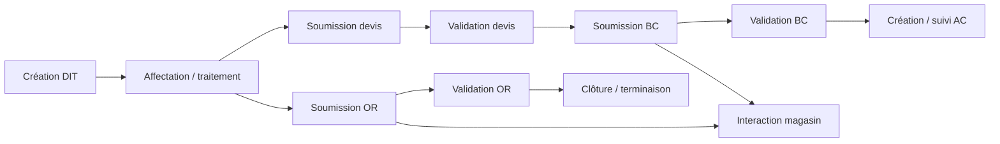
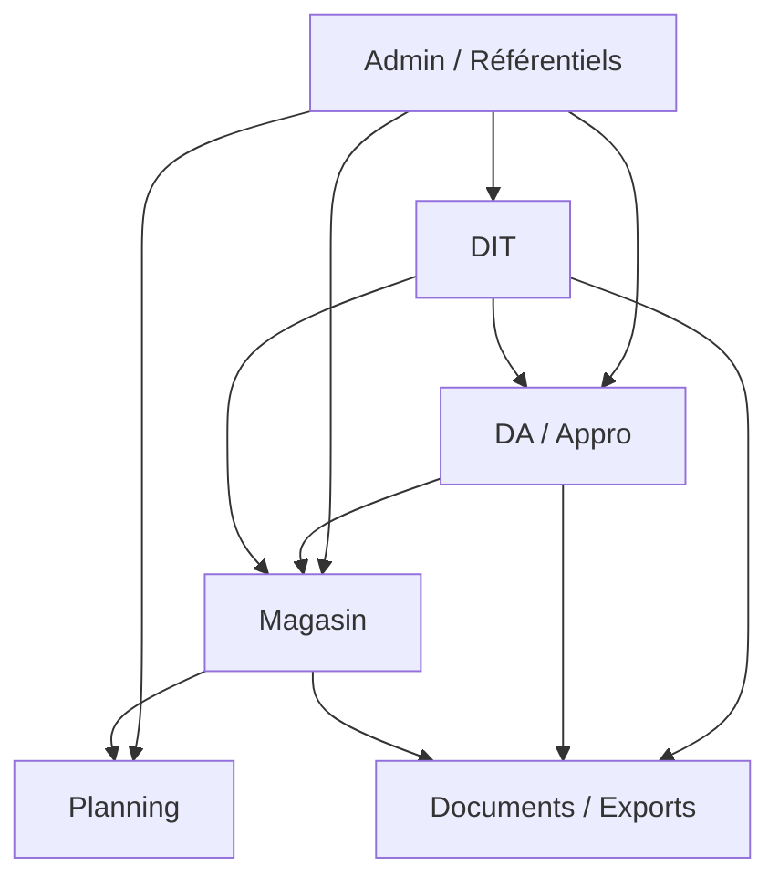
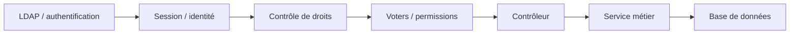
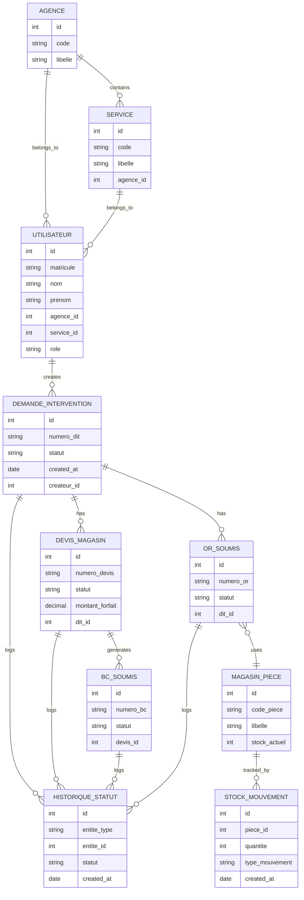

# Analyse de `ref` et feuille de route de migration

## 1. Objectif

Ce document sert de base de travail pour migrer le projet legacy `ref/` vers la cible actuelle `backend/` + `frontend/`.

L’objectif n’est pas de tout réécrire d’un coup. La bonne approche est une migration incrémentale, par domaines métier, avec coexistence temporaire entre l’existant et la nouvelle stack.

## 2. Lecture de l’existant, du plus petit au plus grand

### 2.1 Socle technique

Le legacy `ref/` est une application PHP/Symfony atypique, structurée autour de fichiers de bootstrap maison, de rendu Twig, de scripts de compilation/cache et d’un mélange de persistance Doctrine + SQL brut + connexions legacy.

Les fichiers structurants à retenir sont les suivants :

- [index.php](../../ref/index.php)
- [doctrineBootstrap.php](../../ref/doctrineBootstrap.php)
- [cli-config.php](../../ref/cli-config.php)
- [config/bootstrap_build.php](../../ref/config/bootstrap_build.php)
- [config/bootstrap_runtime.php](../../ref/config/bootstrap_runtime.php)
- [config/services.yaml](../../ref/config/services.yaml)
- [config/doctrine.yaml](../../ref/config/doctrine.yaml)

Le point important ici est que la logique d’exécution est déjà séparée entre précompilation et runtime, ce qui facilite une transition progressive vers une architecture moderne.

### 2.2 Couche HTTP

Le flux classique du legacy est :

1. Entrée front controller.
2. Bootstrap de configuration et du conteneur.
3. Routage vers le contrôleur.
4. Vérification d’accès et session.
5. Appel métier ou accès base.
6. Rendu Twig ou réponse JSON/PDF/XLSX.

Les contrôleurs sont organisés par domaines métier. On retrouve typiquement : général, admin, DIT, DA/appro, magasin, DOM, BADM, planning, documents et exports.

### 2.3 Couche métier

Le code métier est dispersé entre :

- `src/Controller/`
- `src/Service/`
- `src/Repository/`
- `src/Model/`
- `src/Form/`
- `src/Entity/`

Le pattern le plus intéressant pour la migration est la logique de validation réutilisable, notamment dans les services de validation récents, qui montrent déjà une volonté de factorisation par domaine.

### 2.4 Couche données

Le projet legacy ne repose pas sur une seule manière de parler à la base. Il mélange :

- Doctrine ORM pour certains modèles.
- SQL brut pour les zones historiques.
- Adaptateurs legacy pour d’autres bases ou moteurs.

Cette hybridation est le principal risque de migration. Elle impose une approche par sous-systèmes, pas un basculement massif.

### 2.5 Couche vues et génération documentaire

Le rendu legacy s’appuie sur Twig, des formulaires Symfony, des exports PDF/XLSX et des scripts de mise en forme cache/build.

Les documents de référence les plus utiles à réutiliser sont :

- [ref/docs/technique/AUDIT_MIGRATION_SYMFONY64_V1.md](../../ref/docs/technique/AUDIT_MIGRATION_SYMFONY64_V1.md)
- [ref/docs/technique/ONBOARDING_ULTRA_COMPLET_DEBUTANT.md](../../ref/docs/technique/ONBOARDING_ULTRA_COMPLET_DEBUTANT.md)
- [ref/docs/technique/architecture_recente.md](../../ref/docs/technique/architecture_recente.md)
- [ref/document/processus.md](../../ref/document/processus.md)
- [ref/document/compteredu.md](../../ref/document/compteredu.md)
- [ref/README - Optimisation - Bootstrap.md](../../ref/README%20-%20Optimisation%20-%20Bootstrap.md)

## 3. Cartographie fonctionnelle

### 3.1 Domaine général / administration

Ce bloc concentre :

- utilisateurs
- agences
- services
- rôles
- permissions
- menus
- configuration d’accès

Ce domaine est transversal. Il sert de fondation à presque tous les autres modules.

### 3.2 DIT

Le domaine DIT porte les demandes d’intervention et les étapes associées : création, affectation, validation, soumission de documents et clôture.

Il est au centre du système parce qu’il connecte plusieurs autres blocs : devis, BC, OR, magasin et validation.

### 3.3 DA / approvisionnement

Le domaine approvisionnement gère les demandes d’achat, la validation des devis, la génération de BC et les flux fournisseurs.

### 3.4 Magasin

Le domaine magasin traite le stock, les pièces, les allocations, les réservations et le suivi de consommation.

### 3.5 Planning / atelier / organisation

Le domaine planning sert à organiser des ressources ou des créneaux, avec des interactions fortes avec les opérations magasin et certaines demandes métier.

### 3.6 DOM / BADM / RH / contrats

Ces modules semblent plus spécialisés et plus variés fonctionnellement. Ils doivent être traités après le socle commun et les parcours cœur métier, sauf si une contrainte utilisateur impose un ordre différent.

## 4. Flux métier critiques

### 4.1 Chaîne principale DIT

### 4.2 Dépendances entre modules

### 4.3 Chaîne de sécurité

## 5. Modèle de données conceptuel

Le modèle ci-dessous représente les objets métier les plus visibles dans le legacy. Il n’est pas encore la vérité de production finale, mais il sert de base commune pour la migration.

## 6. Ce que le backend cible doit reprendre

Le backend actuel est un bon point de départ technique, mais il est encore trop petit pour absorber `ref` tel quel.

À conserver et renforcer :

- Symfony 5.4
- Doctrine ORM et migrations
- API Platform
- LDAP/JWT pour l’authentification
- envoi de fichiers et exports
- séparation contrôleurs / services / repositories

À ajouter rapidement :

- vraie couche domaine par module
- DTO et validation d’entrée
- gestion standardisée des erreurs API
- tests métier et tests d’intégration
- stratégie de coexistence avec le legacy

## 7. Ce que le frontend cible doit reprendre

Le frontend React actuel est très léger. Il doit devenir une vraie interface métier, avec navigation, formulaires, listes et parcours sécurisés.

À ajouter rapidement :

- routing applicatif
- authentification robuste
- couche API centralisée
- gestion d’état métier
- composants liste / détail / formulaire
- design system minimal et stable

## 8. Roadmap de migration recommandée

### Phase 0 — socle technique et sécurité

- fiabiliser l’authentification
- normaliser les réponses API
- réduire les accès SQL brut
- documenter les rôles et permissions
- mettre en place l’observabilité de base

### Phase 1 — référentiels et admin

- utilisateurs
- agences
- services
- rôles
- permissions
- menus et accès

### Phase 2 — lecture métier simple

- listes consultables sans écriture
- lecture DIT / DA / magasin selon la criticité
- endpoints de filtrage et pagination

### Phase 3 — parcours métier cœur

- DIT
- devis
- BC
- OR
- magasin

### Phase 4 — modules spécialisés

- planning
- DOM
- BADM
- contrats
- documents complexes

### Phase 5 — décommission du legacy

- arrêt des doubles écritures inutiles
- bascule complète des vues
- archivage des anciens parcours
- fermeture progressive du `ref/` runtime

## 9. Livrables de documentation à produire

1. Une cartographie fonctionnelle complète par module.
2. Une carte des entités métier et de leurs relations.
3. Une liste des flux métier et de leurs statuts.
4. Une matrice des risques techniques et sécuritaires.
5. Un guide de migration backend.
6. Un guide de migration frontend.
7. Un catalogue d’API cible par domaine.
8. Un plan de tests minimum par parcours critique.

## 10. Point d’attention important

La plus grosse erreur serait de migrer la couche visuelle avant d’avoir figé les contrats métier et les états de validation.

La bonne séquence est : données, règles, API, puis interface.

## 11. Prochaine étape utile

La suite logique est de découper ce document en trois artefacts opérationnels :

- un inventaire détaillé des modules legacy
- un schéma de données exploitable pour le backend
- une roadmap de migration par sprint ou par lot métier

## 12. Couverture et limites

La couverture de references est maintenant etendue et tracee par inventaire automatique fichier par fichier (hors `ref/.git`).

Elements verifies :

- manifeste complet: `docs/migration/generated/ref-file-manifest.txt`
- repartition technique: `docs/migration/generated/ref-layer-counts.txt`
- index des routes: `docs/migration/generated/ref-routes-index.txt`
- index des types PHP: `docs/migration/generated/ref-php-types-index.txt`
- inventaires de couches: entities, repositories, services, forms, models
- inventaires de docs, vues, scripts, tests
- inventaire SQL et index DDL/DML

Volumes constates :

- 1789 fichiers dans `ref/` (hors `.git`)
- 210 controllers, 137 entities, 102 repositories, 131 services, 121 forms, 76 models
- 98 scripts SQL, 641 fichiers de vue, 49 fichiers de test

Limites restantes (normales pour un legacy de cette taille) :

- toutes les regles metier implicites ne sont pas deduisibles seulement par scan statique
- certaines conventions historiques sont documentees dans des notes de passation et peuvent necessiter validation metier
- les scripts SQL peuvent contenir des variantes environnementales a confirmer en pre-production

En pratique, l’inventaire de references est complet, mais la validation fonctionnelle finale doit encore passer par ateliers metier et tests de non-regression.

Le niveau de confiance actuel est donc :

- eleve pour l’exhaustivite des references techniques
- eleve pour l’architecture generale
- eleve pour les flux DIT / DA / magasin / admin
- moyen pour DOM / BADM / planning / modules specialises
- moyen pour l’interpretation metier fine tant que les ateliers de validation ne sont pas termines

## 13. Pack de references complet

Pour audit et traçabilité complete, utiliser les fichiers generes suivants :

- `docs/migration/generated/ref-file-manifest.txt`
- `docs/migration/generated/ref-top-level-counts.txt`
- `docs/migration/generated/ref-layer-counts.txt`
- `docs/migration/generated/ref-routes-index.txt`
- `docs/migration/generated/ref-controller-domain-route-counts.txt`
- `docs/migration/generated/ref-php-types-index.txt`
- `docs/migration/generated/ref-entities-files.txt`
- `docs/migration/generated/ref-entity-domain-counts.txt`
- `docs/migration/generated/ref-repositories-files.txt`
- `docs/migration/generated/ref-repository-domain-counts.txt`
- `docs/migration/generated/ref-services-files.txt`
- `docs/migration/generated/ref-service-domain-counts.txt`
- `docs/migration/generated/ref-forms-files.txt`
- `docs/migration/generated/ref-form-domain-counts.txt`
- `docs/migration/generated/ref-models-files.txt`
- `docs/migration/generated/ref-model-domain-counts.txt`
- `docs/migration/generated/ref-sql-files.txt`
- `docs/migration/generated/ref-sql-ddl-dml-index.txt`
- `docs/migration/generated/ref-sql-create-table-names.txt`
- `docs/migration/generated/ref-docs-files.txt`
- `docs/migration/generated/ref-document-files.txt`
- `docs/migration/generated/ref-views-files.txt`
- `docs/migration/generated/ref-scripts-files.txt`
- `docs/migration/generated/ref-tests-files.txt`

